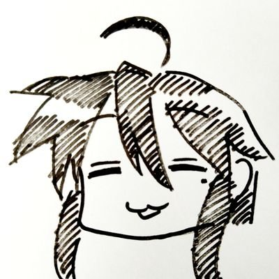

<h1 class="title">セキュキャンCコンパイラゼミ行くので、Cコンパイラ書く</h1>
<h2 class="sub">〜いわゆる事前学習ってやつ〜</h2>
<h2 class="where">UNTIL.LT 0x08 2025/07/19</h2>

---

# とりあえず、自己紹介

こんにちは。
情報科学類2年のゃー(reversed_R)です。

Twitter: [@reversed_R](https://x.com/reversed_R)
GitHub: [reversed-R](https://github.com/reversed-R)
HP: [https://reversed-r.dev](https://reversed-r.dev)

---

# セキュキャン全国Cコンパイラゼミに行くことに

---

## セキュキャン とは
 [(独立行政法人情報処理推進機構)](https://www.ipa.go.jp/)が主催する、全国からオタクを募り、夏の暑い中東京の施設に5日間軟禁する大会。

- 夏にやるやつを`全国`大会といい
  - 中高生向けの`ジュニア`
  - 全国卒業生向けの`ネクスト`も合わせて開催
- 適当な時期に各地で`ミニ`キャンプもやっている

---

# セキュキャン全国Cコンパイラゼミに行くことに

全国大会の様々なゼミがあるうちの**Cコンパイラ**自作ゼミに通りました。

講師: [hsjoihs](https://x.com/hsjoihs)さん 

---

# おわり

ありがとうございました。
